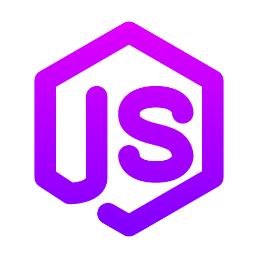

  
  <h1>🚀 Portfólio Back-end: Arquitetura e Soluções</h1>
  
  

    
    
  

  
  

    <i>"Construindo a fundação sólida de sistemas escaláveis e seguros."</i>
  

 

<h2>🔹 Sobre o Projeto</h2>

  Este portfólio foi desenvolvido para demonstrar habilidades técnicas em desenvolvimento back-end, focando em uma interface moderna que utiliza <b>Glassmorphism</b> e uma rede de partículas interativas para representar a complexidade das conexões de sistemas.

<ul>
  <li><b>Imersão:</b> Experiência de tela cheia (Full-screen sections).</li>
  <li><b>Dinâmica:</b> Background interativo com <i>Particles.js</i>.</li>
  <li><b>Performance:</b> Código limpo e otimizado para carregamento rápido.</li>
</ul>

<h2>🛠️ Stack Tecnológica</h2>

<table width="100%">
  <tr>
    <td width="33%" align="center"><b>Linguagens & Runtime</b></td>
    <td width="33%" align="center"><b>Infraestrutura</b></td>
    <td width="33%" align="center"><b>Versionamento</b></td>
  </tr>
  <tr>
    <td align="center">Node.js, Java, JavaScript</td>
    <td align="center">Docker, SQL/NoSQL</td>
    <td align="center">Git, GitHub Actions</td>
  </tr>
</table>

 

<h2>📂 Estrutura do Repositório</h2>
<pre>
PORTIFÓLIO/
├── images/             # Assets e ícones de tecnologias
├── index.html          # Ponto de entrada (Estrutura)
├── style.css           # Design Deep Blue & Glassmorphism
└── script.js           # Lógica de partículas e navegação
</pre>

<h2>🚀 Como Executar</h2>

Para visualizar este portfólio localmente, siga os passos abaixo:

<ol>
  <li>Clone o repositório:
     <code>git clone https://github.com/seu-usuario/seu-repositorio.git</code>
  </li>
  <li>Navegue até o diretório:
     <code>cd seu-repositorio</code>
  </li>
  <li>Abra o arquivo <b>index.html</b> em seu navegador.</li>
</ol>

  <h2>📫 Vamos nos conectar?</h2>
  
Estou sempre em busca de novos desafios e colaborações técnicas.

  
  
  
  
  
    
  
Desenvolvido com dedicação por <b>Larissa</b> 🚀

